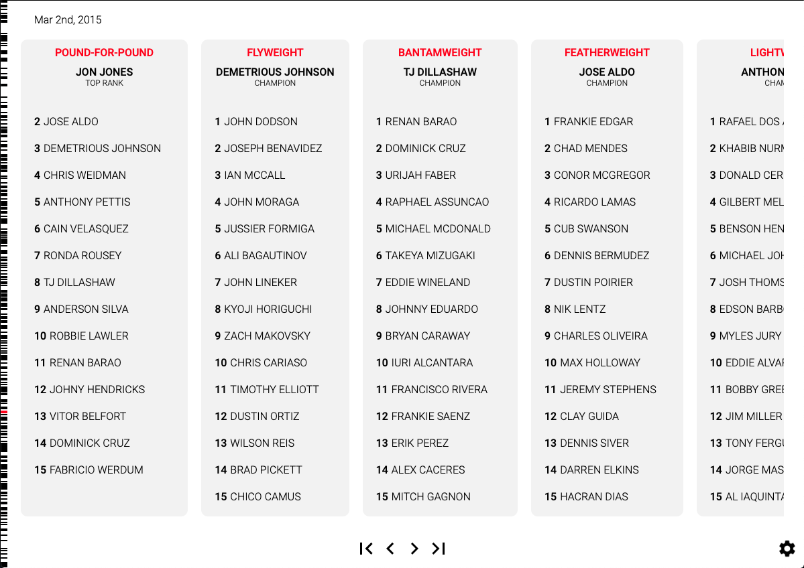
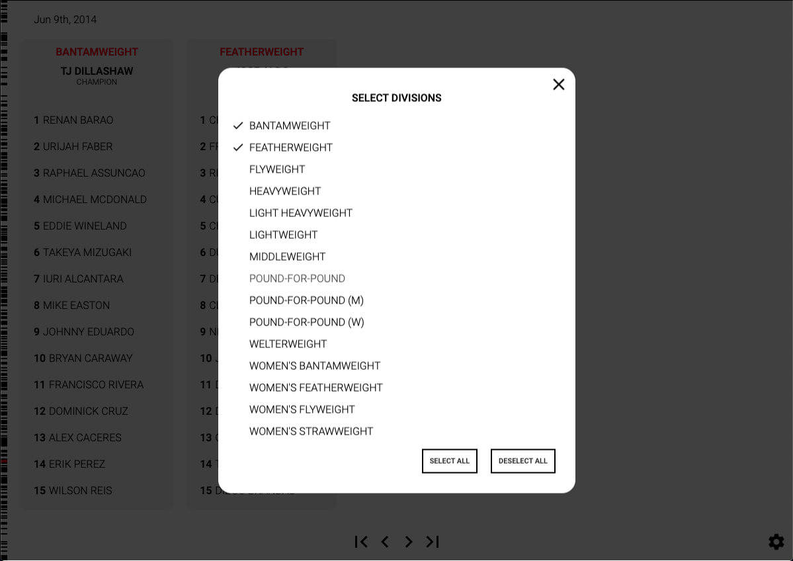
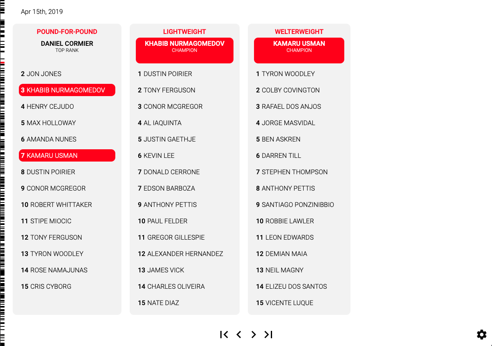

# [Historical UFC Rankings](http://app.historicalufcrankings.com)

An interactive data exploring application for the history of the UFC rankings, since their inception.

## Technical Architechture

### UI

The current interface is a single page front-end app web app written in React. The front-end makes async requests to publically hosted JSON files in an S3 bucket to retrieve the data.

### Data Injestion

In the `/data-injestion` directory you'll find a series of python scripts that compose a semi-automated data injestion pipeline which ensure the data set is up to date. When there is an update to the offcial rankings, `pull_rankings.py` (which utilizes selenium) can be run to scrape [ufc.com](https://www.ufc.com/rankings) to pull the new rankings data and structure them into a rankings history JSON object. This new rankings history JSON object can then be merged into a master rankings history JSON object using my `append_json.py` utility script.

Note: The schema definition of a rankings history object can be found in `/data-injestion/structure_rankings_history.py` or `/src/types/rankings-history.js`

The master data set was originally seeded from [this dataset via Kaggle](https://www.kaggle.com/martj42/ufc-rankings). This dataset was pulled from The Internet Archive's records of [ufc.com](https://www.ufc.com/rankings). `structure_rankings_history.py` was used to restructure this dataset's csv format into my rankings history JSON format.

## Preview

